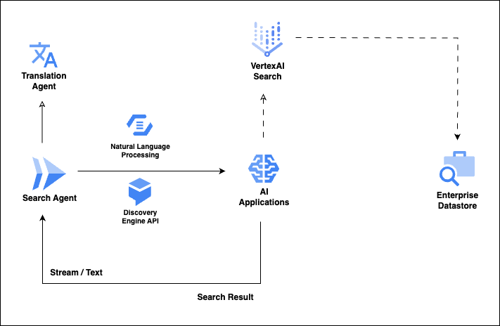

# Enterprise Search, Simplified: Building Your Custom Internal Search Agent

## High Level Design overview




## Prelude

Deployment uses the following tools:

- **Terraform for GCP** - Infrastructure deployment
- **Cloud Build** - YAML scripts which acts as a wrapper around Terraform Deployment scripts

### Pre-requisites

- **gcloud CLI** - Used to setup the end to end Infrastructure on GCP.
  - [Install the gcloud CLI](https://cloud.google.com/sdk/docs/install)

- Or, **GCP Cloud Shell**
  - [Run gcloud commands with Cloud Shell](https://cloud.google.com/shell/docs/run-gcloud-commands)

## Step-by-Step guide

Here is a step by step guide on how to deploy this entire infrastructure end to end

### Setup CLI environment variables

```bash
BASEFOLDERPATH=<Root folder path>
DISTRIBUTION_PATH=$BASEFOLDERPATH/distribution
OWNER=<Project Owner ID>
PROJECT_ID=<Project ID>

(Note: This ideally should be same as PROJECT_ID; or any preferred name to identify the proejct)
PROJECT_NAME=<Project NAME>

(#Note: Changing the below naming format for GSA_DISPLAY_NAME and GSA will need some change in the some of the deployment file(s) as explained later)
GSA_DISPLAY_NAME=$PROJECT_NAME-sa
GSA=$GSA_DISPLAY_NAME@$PROJECT_ID.iam.gserviceaccount.com
REGION=<GCP Region of the PROJECT>
ZONE=<GCP Zone of the PROJECT>
AI_LOCATION=<GCP Region for VertexAI APIs>
REPO_NAME=<Artifact Registry Repositry>
PACKAGE_NAME="search-agentlib"
PACKAGE_VERSION="v1.0"
```

> [!Note]
>
> **PROJECT_NAME** - This ideally should be same as *PROJECT_ID*; or any preferred name to identify the project.
>
> **GSA_DISPLAY_NAME** - This is the dIsplay name of a *google service account* to be used across this deployment. The recommended format is **$PROJECT_NAME-sa**
>
> **GSA=$GSA_DISPLAY_NAME@$PROJECT_ID.iam.gserviceaccount.com**
>
> Ideally these formats should not be changed as it might impact multiple deployment steps and hence might need modifications in multiple deployment file(s).


#### Authenticate user to gcloud

```bash
gcloud auth login
gcloud auth list
gcloud config set account $OWNER
```

#### Setup current project

```bash
gcloud config set project $PROJECT_ID

gcloud services enable cloudresourcemanager.googleapis.com
gcloud services enable compute.googleapis.com
gcloud services enable container.googleapis.com
gcloud services enable storage.googleapis.com
gcloud services enable artifactregistry.googleapis.com
gcloud services enable run.googleapis.com
gcloud services enable aiplatform.googleapis.com
gcloud services enable translate.googleapis.com
gcloud services enable texttospeech.googleapis.com
gcloud services enable vision.googleapis.com
gcloud services enable apigee.googleapis.com
gcloud services enable servicenetworking.googleapis.com
gcloud services enable cloudkms.googleapis.com
gcloud services enable mesh.googleapis.com
gcloud services enable certificatemanager.googleapis.com
gcloud services enable cloudbuild.googleapis.com

gcloud config set compute/region $REGION
gcloud config set compute/zone $ZONE
```

#### Setup Service Account

Current authenticated user will handover control to a **Service Account** which would be used for all subsequent resource deployment and management

```bash
gcloud iam service-accounts create $GSA_DISPLAY_NAME --display-name=$GSA_DISPLAY_NAME
gcloud iam service-accounts list

# Make SA as the owner
gcloud projects add-iam-policy-binding $PROJECT_ID --member=serviceAccount:$GSA --role=roles/owner

# ServiceAccountUser role for the SA
gcloud projects add-iam-policy-binding $PROJECT_ID --member=serviceAccount:$GSA --role=roles/iam.serviceAccountUser

# ServiceAccountTokenCreator role for the SA
gcloud projects add-iam-policy-binding $PROJECT_ID --member=serviceAccount:$GSA --role=roles/iam.serviceAccountTokenCreator
```

#### Create Storage Buckets

- Bucket to store **Terraform** state (*if terraform deployment is chosen, as explained later*)

  ```bash
  #This is just an example; please feel free to chose any name here of your choice
  gcloud storage buckets create gs://$PROJECT_ID-terra-stg-<some-random-no> --location=us-central1
  ```

- Bucket to store various VertexAI and Generative AI resources


```bash
#This is just an example; please feel free to chose any name here of your choice
gcloud storage buckets create gs://$PROJECT_ID-docs-stg-<some-random-no> --location=us-central1
```

> [!Note]
>
> This document outlines the secure mechanism for sharing deployment files, as these files may contain sensitive, system-specific information.
>
> #### Deployment File Handling
>
> - **Template Location:** All Helm chart deployment templates are located in the **/distribution/cloud-run/values.tpl** directory.
>- **Procedure:** To prepare for deployment, copy the **values.tpl** folder to a new directory named **values**. Modify the files within the new **values** folder with the specific values for your target system.
> - **Deployment Workflow:** All subsequent deployment steps will reference the modified **values** folder.


### Artifact Registry

```bash
#Create Repository
gcloud artifacts repositories create $AR_REPO --repository-format=docker --location=$REGION

#List Repository
gcloud artifacts repositories list --location=$REGION

#Describe Repository
gcloud artifacts repositories describe $AR_REPO --location=$REGION

#gcloud artifacts repositories delete $AR_REPO --location=$REGION
```


### Distribution

> [!NOTE]
>
> This document uses [Cloud Build](https://cloud.google.com/build/docs) scripts for all deployment onto GCP.  Cloud Build scripts are designed to call terraform scripts internally for deploying individual resources. This can be replaced by any other deployment automation tool of choice.
>
> The solution is deployed to Cloud Run instances on GCP. This can be replaced by other similar services like GKE.

Let us examine the Files used for distributing the solution and how to use them for deployment.

#### Build and Push Container Images

**/distribution/builds/app-deploy/app-deploy.yaml**

```yaml
steps:
- name: 'docker'  
  args: ['build', '-t', '${_REGION_}-docker.pkg.dev/${_PROJECT_ID_}/${_REPO_NAME_}/${_PACKAGE_NAME_}:${_PACKAGE_VERSION_}', '.']
images:
- '${_REGION_}-docker.pkg.dev/${_PROJECT_ID_}/${_REPO_NAME_}/${_PACKAGE_NAME_}:${_PACKAGE_VERSION_}'
tags: ['cloud-builders-community']
serviceAccount: "projects/${_PROJECT_ID_}/serviceAccounts/${_PROJECT_NAME_}-sa@${_PROJECT_ID_}.iam.gserviceaccount.com"
logsBucket: "gs://${_LOG_BUCKET_}"
substitutions:
  _PROJECT_ID_: ''
  _PROJECT_NAME_: ''
  _REGION_: ''
  _REPO_NAME_: ''
  _PACKAGE_NAME_: ''
  _PACKAGE_VERSION_: ''
  _LOG_BUCKET_: ''
options:
    dynamicSubstitutions: true

```


#### Deploy Cloud Run

**/distribution/cloud-run/backend.tf**

- GCS Bucket to hold Terraform State

```json
terraform {
  backend "gcs" {
    bucket = "<bucket for holding terraform state>"
    prefix = ""
  }
}
```


**/distribution/cloud-run/variables.tf**

- Template file for Terrform variables.
- Actual values to be passed from environment specific files (*shown below*)

```json
variable "projectInfo"{    
    type = object({
        project = string
        region = string        
        serviceAccount = string
    })
    
    default = {
        project = ""
        region = ""
        serviceAccount = ""
    }
}

variable "cloudrunInfo"{
    type = object({
        name = string        
        spec = object({
            image = string
            ingress = string
            minCount = optional(string)
            maxCount = optional(string)
            traffic = number            
            limits = object({
                cpu = string
                memory = string
            })
            requests = object({
                cpu = string
                memory = string
            })             
        })
        ports = object({
            name = string
            protocol = string
            container_port = number
        })
        envVars = optional(list(object({
            name = string
            value = string
        })))        
        members = list(string)        
    })

    default = {
        name = ""
        spec = {
            image = ""
            ingress = ""                        
            traffic = 100            
            requests = {
                cpu = ""
                memory = ""
            }
            limits = {
                cpu = ""
                memory = ""
            }
        }
        ports = {
            name = ""
            protocol = ""
            container_port = 0
        }
        envVars = []        
        members = []        
    }    
}
```


**/distribution/cloud-run/run-deploy.tf**

- Terraform script to deploy Cloud Run instances

```json
provider "google" {
    project = var.projectInfo.project
    region = var.projectInfo.region
}

resource "google_cloud_run_service" "cr_service" {    
    name = var.cloudrunInfo.name
    location = var.projectInfo.region
    template {
      spec {
        containers {
          image = var.cloudrunInfo.spec.image
          resources {
            limits = {
              cpu = var.cloudrunInfo.spec.limits.cpu
              memory = var.cloudrunInfo.spec.limits.memory
            }
            requests = {
              cpu = var.cloudrunInfo.spec.requests.cpu
              memory = var.cloudrunInfo.spec.requests.memory
            }
          }
          ports {
            name = var.cloudrunInfo.ports.name
            protocol = var.cloudrunInfo.ports.protocol
            container_port = var.cloudrunInfo.ports.container_port 
          }          
          dynamic "env" {
            for_each = var.cloudrunInfo.envVars
            content {
              name = env.value.name
              value = env.value.value
            }            
          }
        }        
        service_account_name = var.projectInfo.serviceAccount
      }
      
      metadata {
        annotations = {
          "autoscaling.knative.dev/minScale" = var.cloudrunInfo.spec.minCount
          "autoscaling.knative.dev/maxScale" = var.cloudrunInfo.spec.maxCount        
        }
      }
    }

    traffic {
      percent = var.cloudrunInfo.spec.traffic
      latest_revision = true
    }

    metadata {
      annotations = {
        "run.googleapis.com/ingress" = var.cloudrunInfo.spec.ingress               
      }
    }
}

resource "google_cloud_run_service_iam_binding" "cr_binding" {  
  project = var.projectInfo.project
  location = var.projectInfo.region
  service = var.cloudrunInfo.name
  role = "roles/run.invoker"
  members = var.cloudrunInfo.members
  depends_on = [
    google_cloud_run_service.cr_service
  ]
}
```


**/distribution/cloud-run/values/search-agent-values.tfvars**

> [!NOTE]
>
> Due to the sensitive nature of these values, this document recommends a secure method for sharing the file via a source repository.
>
> To implement this approach:
>
> - Copy the **values** folder to a new folder named **values.tmpl**.
> - Replace all sensitive values within **values.tmpl** with placeholders.
> - Check the **values.tmpl** file into the repository.
> - Add the **values** folder to the **.gitignore** file to prevent it from being committed to the repository.

```json
projectInfo = {    
    project = "<project_id>"
    region = "<region>"
    serviceAccount = "<service-account-name>@<project_id>.iam.gserviceaccount.com"
}

cloudrunInfo = {
    name = "search-agentlib"
    spec = {
        image = "<repo-name>/search-agentlib:v1.0"
        ingress = "all"
        minCount = "1"
        maxCount = "10"
        traffic = 100
        requests = {
            cpu = "500m"
            memory = "512Mi"
        }
        limits = {
            cpu = "1000m"
            memory = "1Gi"
        }
    }
    ports = {
        name = "http1"
        protocol = "TCP"
        container_port = 80
    }
    envVars = [
    {
        name = "service"
        value = "search-agentlib:v1.0"
    },
    {
        name = "DISCOVERY_ENGINE_HOST"
        value = "discoveryengine.googleapis.com/v1alpha"
    },
    {
        name = "DISCOVERY_ENGINE_SEARCH_PROMPT"
        value = "You are a helpful assistant that answers the given question accurately based on the context provided to you. Make sure you answer the question in as much detail as possible, providing a comprehensive explanation. Do not hallucinate or answer the question by yourself. Provide the final answer in numbered steps. Also explain each steps in detail. Give the final answer in the following format, give the answer directly, dont add any prefix or suffix, Dont give the answer in json or array, just the steps trailed by comma or new line. Dont attach any reference or sources in the answer. If there is some version mention in the question, then get the answer from the contnet of that particular version only, dont take answer from any other version content. If the context contains any contract link relevant to the answer, then provide that link in the answer too. If an example or sample payload can be used to better explain the answer, provide that in the final answer as well. Give the final answer in the following format, give the answer directly, dont add any prefix or suffix. Dont attach any reference or sources in the answer.The user is an expert who has an in-depth understanding of the subject matter. The assistant should answer in a technical manner that uses specialized knowledge and terminology when it helps answer the query."
    },
    {
        name = "PROJECT_ID"
        value = "<project-id>"
    }]
    members = ["allUsers"]
}
```


### Automate deployment to Cloud Run

**/distribution/builds/cloud-run/run-deploy.yaml**

- Cloud Build script to automate Cloud run deployment through terraform.
- This script will execute all terraform steps (*init, plan, apply*)  sequentially.

```json
steps:
- name: 'hashicorp/terraform:1.12.2'
  dir: '${_WORKING_DIR_}'
  args: ['init', '--reconfigure', '--backend-config=${_BKEND_CONFIG_}']  
- name: 'hashicorp/terraform:1.12.2'
  dir: '${_WORKING_DIR_}'
  args: ['plan', '-out', 'out.plan', '-var-file', '${_TF_VARS_PATH_}']
- name: 'hashicorp/terraform:1.12.2'
  dir: '${_WORKING_DIR_}'
  args: ['apply', 'out.plan']
tags: ['cloud-builders-community']
serviceAccount: "projects/${_PROJECT_ID_}/serviceAccounts/${_PROJECT_NAME_}-sa@${_PROJECT_ID_}.iam.gserviceaccount.com"
logsBucket: "gs://${_LOG_BUCKET_}"
substitutions:
  _PROJECT_ID_: ''
  _PROJECT_NAME_: ''
  _WORKING_DIR_: ''  
  _TF_VARS_PATH_: ''
  _LOG_BUCKET_: ''
  _RESOURCE_NAME_: ''
  _BKEND_CONFIG_: 'prefix=terraform/state/${_WORKING_DIR_}/${_RESOURCE_NAME_}'
options:
    dynamicSubstitutions: true
```


#### Run Cloud Build script from CLI

```bash
cd $BASEFOLDERPATH/microservices/agents

#Build container image from source
gcloud builds submit --config="$BASEFOLDERPATH/distribution/builds/app-deploy/app-deploy.yaml" \
--project=$PROJECT_ID --substitutions=_PROJECT_ID_=$PROJECT_ID,_PROJECT_NAME_=$PROJECT_NAME,_REGION_=$REGION,\
_REPO_NAME_=$REPO_NAME,_PACKAGE_NAME_=$PACKAGE_NAME,_PACKAGE_VERSION_=$PACKAGE_VERSION,\
_LOG_BUCKET_=$PROJECT_ID-terra-stg

#Distribute package through Cloud Run
cd $BASEFOLDERPATH/distribution
WORKING_DIR="cloud-run"
RESOURCE_NAME="search-agentlib"

gcloud builds submit --config="./builds/cloud-run/run-deploy.yaml" \
--project=$PROJECT_ID --substitutions=_PROJECT_ID_=$PROJECT_ID,_PROJECT_NAME_=$PROJECT_NAME,\
_WORKING_DIR_="$WORKING_DIR",_TF_VARS_PATH_="./values/search-agent-values.tfvars",\
_LOG_BUCKET_=$PROJECT_ID-terra-stg,_RESOURCE_NAME_=$RESOURCE_NAME

#Delete the Cloud Run instance
#gcloud builds submit --config="./builds/cloud-run/run-destroy.yaml" \
--project=$PROJECT_ID --substitutions=_PROJECT_ID_=$PROJECT_ID,_PROJECT_NAME_=$PROJECT_NAME,\
_WORKING_DIR_="$WORKING_DIR",_TF_VARS_PATH_="./values/search-agent-values.tfvars",\
_LOG_BUCKET_=$PROJECT_ID-terra-stg,_RESOURCE_NAME_=$RESOURCE_NAME
```

# References

- [Vertex AI](https://cloud.google.com/vertex-ai/docs)
- [Generative AI on Vertex AI](https://cloud.google.com/vertex-ai/generative-ai/docs/learn/overview)
- [VertexAI Search](https://cloud.google.com/generative-ai-app-builder/docs/introduction)
- [Cloud Build](https://cloud.google.com/build/docs)
- [Cloud Run](https://cloud.google.com/run/docs)

